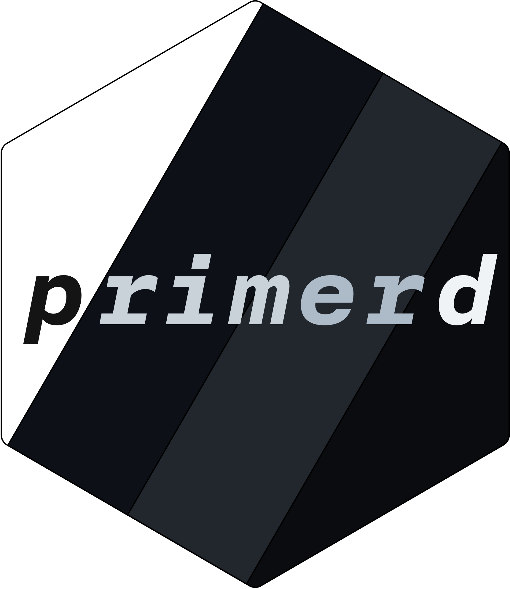

<!-- README.md is generated from README.Rmd. Please edit this file -->

# primermd 

**`{primermd}`** is a versatile template for `{rmarkdown}` based on [Primer
CSS](http://primer.style/css/) developed by GitHub. Primer CSS is very readable, 
accessible, and responsive; however, it is really not meant to be used for 
a simple one-page document. That being said, I quite like it, and that's why
this package exists! I wanted to be able to get as close as I can to GitHub's
Markdown rendering, so, I went with their framework! 🙃

`{primermd}` is, by design, not very customizable, in fact, I have intentionally
removed some basic options that you can find in similar template packages, 
e.g., prismjs syntax highlight, Font Awesome. As said, my main goal is to
replicate GitHub's Markdown rendering, and add some of the features that they 
are adding to their website, e.g., check boxes, alerts, etc. 

In the future, if I have some time, I would like to continue tweaking this, and 
keeping it up to date with GitHub's changes, and aesthetic.


## Installation

You can install the latest development version from
[GitHub](https://github.com/amirmasoudabdol/primermd/):

``` r
remotes::install_github("amirmasoudabdol/primermd")
```

and, hopefully **soon**, you can install the released version of primermd from CRAN:

``` r
# ⚠️ Not Working Yet!
install.packages("primermd") 
```

## Usage

You may activate the `{primermd}` theme by adding the following line to
the top of your R Markdown file.

``` yaml
output: 
  primermd::html_document_primer
```

## Customizations

{primermd} offers a few customization options and features, e.g., theme,
title customization. You can tweak the behavior, and looks of the theme
by adding more parameters to your YAML header as described below.

### Themes

Primer CSS automatically adjusts to user's system settings, and it
delivers either light, or dark theme of the page accordingly based on
the current appearance of the system. If you wish to disable this
automatic behavior, you may set the `auto_theme` variable to `false`,
and as a result adaptive theme-ing will be disabled.

In addition to default `light` and `dark` themes, you can choose two
darker themes, i.e., `dark_dimmed`, `dark_high_contrast`. You can select
either of these themes using `light_theme` and `dark_theme` parameters.

``` yaml
output: 
  primermd::html_document_primer:
    auto_theme: true
    light_theme: light
    dark_theme: dark_dimmed
```

> ⚠️ At the moment, RStudio does not adapt to user preferences and therefore 
{primermd} does not work as expcted inside the RStudio. However, if you open the
generated file in your browser you'll get the adaptive behavior.

### Title Customization

By default, {primermd} adds the title, subtitle, author and the date to
the top of the document; however, you can disable this by setting the
`header` parameter to `false`.

``` yaml
output: 
  primermd::html_document_primer:
    header: false
```

### Footer Customization

By default, the footer of the page contains the authors names', but
it is possible to hide the footer entirely by setting the `footer`
parameter to `false`.

``` yaml
output: 
  primermd::html_document_primer:
    footer: false
```

### List Style

By setting the `list_style_none` parameter to `true`, you can remove bullets
from an unordered list or numbers from an ordered list.

``` yaml
output: 
  primermd::html_document_primer:
    list_style: none
```

### Enable the Checkboxes

By setting the `enable_checkboxes` parameter to `true`, you can enable the
check box controls such that readers can interact with them.

``` yaml
output: 
  primermd::html_document_primer:
    enable_checkboxes: true
```

### Syntax Highlight

By setting the `highlight` to `false`, you can disable the syntax highlighting.
{primermd} does not allow you to change the color scheme of the code 
highlighter. I'm working on enabling this, but it is a bit tricky because I want
to have a list of schemes that look good with all the settings.

## Todos

- [ ] Make it possible to change the width of the page
- [ ] Make use of [Octicons](https://primer.style/octicons/), replacing the
Font Awesome
- [ ] Add `use_primermd()`
- [ ] Find a matching color scheme for syntax highlighting
- [x] Make sure that the table of content looks alright

## Acknowledgments

I should thank [Garrick](https://github.com/gadenbuie) for his awesome R 
Markdown themes, [cleanmd](https://github.com/gadenbuie/cleanrmd). I wanted to 
make this theme for a while, but I had no time, and inspiration to start it. His
project motivated me to work on this project. Oh, and I could not have done it
without his code. Thanks!
