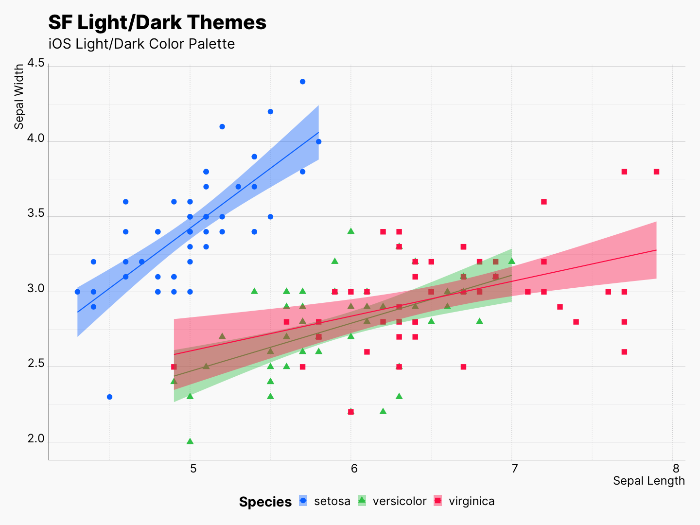

```{r setup, include=FALSE}
knitr::opts_chunk$set(echo = TRUE)
```

This is an R Markdown document. Markdown is a simple formatting syntax for authoring HTML, PDF, and MS Word documents. For more details on using R Markdown see <http://rmarkdown.rstudio.com>.

When you click the **Knit** button a document will be generated that includes both content as well as the output of any embedded R code chunks within the document. You can embed an R code chunk like this:

```{r cars}
summary(cars)
```

## Including Plots

You can also embed plots, for example:

```r
library(ggplot2); library(sfthemes)

gp <- ggplot(aes(x = Sepal.Length,
                 y = Sepal.Width,
                 color = Species)) +
        geom_point(aes(shape = Species)) + 
        xlab("Sepal Length") + ylab("Sepal Width") +
        labs(title = "SF Light/Dark Themes", 
             subtitle = "iOS Light/Dark Color Palette") +
        geom_smooth(method="lm", aes(fill = Species))
        
# Light
gp + theme_sf_light(size_class = "xxxLarge") +
        scale_colour_ios_light(accessible = FALSE) +
        scale_fill_ios_light(accessible = FALSE) +
        theme(legend.position = "bottom")

# Dark
gp + theme_sf_dark(size_class = "xxxLarge") +
        scale_colour_ios_dark(accessible = FALSE) +
        scale_fill_ios_dark(accessible = FALSE) +
        theme(legend.position = "bottom")
```

<picture>
  <source media="(prefers-color-scheme: dark)" srcset="front-page-sample-dark.png">
  <source media="(prefers-color-scheme: light)" srcset="front-page-sample-light.png">
  
</picture>

Note that the `echo = FALSE` parameter was added to the code chunk to prevent printing of the R code that generated the plot.


## A Cool Math Function

[**Weierstrass function**](https://en.wikipedia.org/wiki/Weierstrass_function)

$$f(x)=\sum_{n=0} ^\infty a^n \cos(b^n \pi x),$$

where $0<a<1$,  $b$ is a positive odd integer, and

$$ab > 1+\frac{3}{2} \pi.$$

## Todo List

- [ ] Todo
- [x] Done


## Code 

### Ruby 💎

```ruby
def sum_eq_n?(arr, n)
  return true if arr.empty? && n == 0

  arr.product(arr).reject { |a,b| a == b }.any? { |a,b| a + b == n }
end
```

### Modern Functional C++ Code 👀

```cpp
std::vector<int> const vi{1, 2, 3, 4, 5, 6, 7, 8, 9, 10};
using namespace ranges;
auto rng = vi | views::filter([](int i) { return i % 2 == 0; }) |
               views::transform([](int i) { return std::to_string(i); });
```
